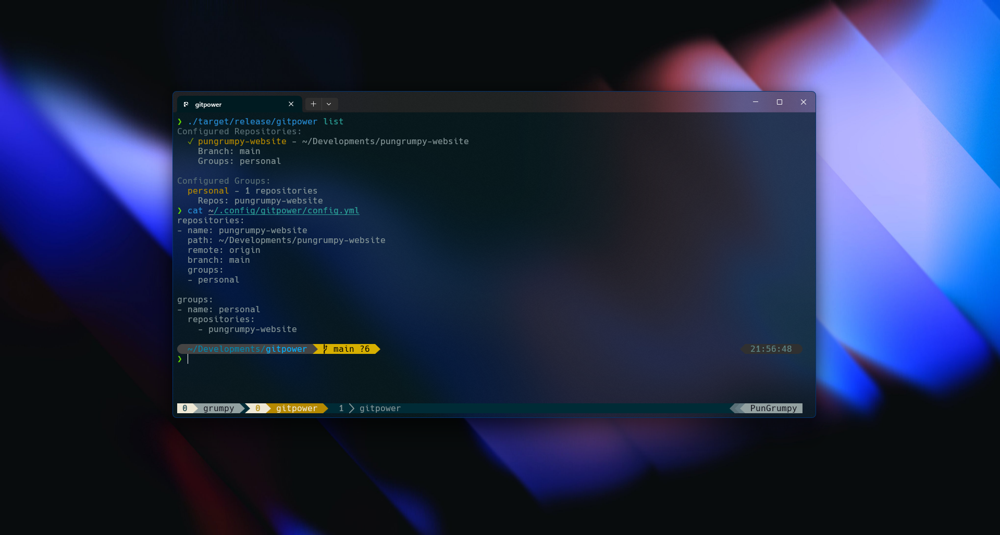

# 🚀 GitPower

A powerful CLI tool for managing multiple Git repositories simultaneously, developed in Rust.



## ✨ Features

- **Sync multiple repositories simultaneously** (pull and push) 🔄
- **Pull changes from all repositories** with a single command 📥
- **Run commands** across multiple repositories 💻
- **Group repositories** for easier management 📁
- **Configure via YAML** for simple setup ⚙️
- **Initialize new repositories** with a single command 🆕
- **Completion for shell** (bash, zsh, fish) 🐚

## 🎯 To-Do

- [ ] Interactive mode (like LazyGit)

## 📦 Installation

### From Source Code

1. Clone the project:

   ```
   git clone https://github.com/PunGrumy/gitpower.git
   cd gitpower
   ```

2. Build with Cargo:

   ```
   cargo build --release
   ```

3. Move the binary to your PATH:

   ```
   sudo mv target/release/gitpower /usr/local/bin/
   ```

### Via Cargo

```
cargo install gitpower
```

## 🛠️ Configuration

GitPower uses a YAML file to configure repositories and groups. By default, it looks for a configuration file at `~/.config/gitpower/config.yml`

Basic configuration example:

```yaml
repositories:
  - name: project-a
    path: ~/projects/project-a
    remote: origin
    branch: main
    groups:
      - work

  - name: dotfiles
    path: ~/dotfiles
    remote: origin
    branch: master
    groups:
      - personal

groups:
  - name: work
    repositories:
      - project-a

  - name: personal
    repositories:
      - dotfiles
```

## 📚 Usage

### Initialize a New Repository

```
gitpower init my-repo ~/projects/my-repo
```

Initialize with remote and branch:

```
gitpower init my-repo ~/projects/my-repo --remote https://github.com/user/my-repo.git --branch main
```

Initialize with groups:

```
gitpower init my-repo ~/projects/my-repo --groups work,personal
```

### List Configured Repositories

```
gitpower list
```

### Sync All Repositories

```
gitpower sync
```

### Sync Specific Repositories

```
gitpower sync project-a dotfiles
```

### Sync Repositories by Group

```
gitpower sync work personal
```

### Pull Changes from All Repositories

```
gitpower pull
```

### Run Commands in All Repositories

```
gitpower run "git status"
```

### Run Commands in Specific Repositories or Groups

```
gitpower run "npm install" web-projects
```

### Use Custom Configuration File

```
gitpower --config ~/my-custom-config.yml list
```

## 🔍 Advanced Usage

### Automatic Syncing with Cron

You can set up a cron job for automatic repository syncing:

```
# Sync every hour
0 * * * * gitpower sync
```

### Shell Aliases

For even quicker access, you can set up shell aliases:

```bash
# In your .bashrc or .zshrc
alias gp="gitpower sync"
alias gpp="gitpower pull"
alias gpr="gitpower run"
```

## 👥 Contributing

Contributions are welcome! Please feel free to submit a Pull Request.

## 📄 License

This project is licensed under the MIT License - see the LICENSE file for details.
